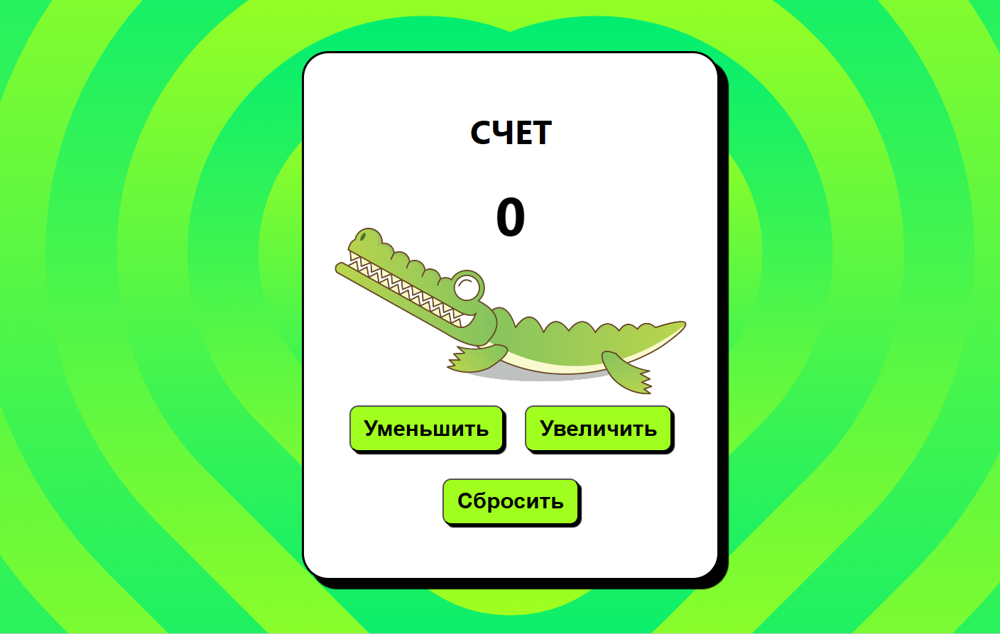

# Счетчик
Scorekeeper is an application for tracking and counting various events. It can be used to fix scores during the game. 
The application has a unique design.You can view the project at the following link: [chet](https://project-counter-mxsy.vercel.app/).

## 🚀 Follow the steps below to work with the application:

Install the package manager

### `npm install`

Start the application

### `npm start`
